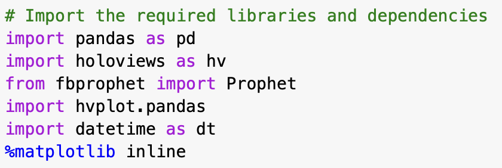
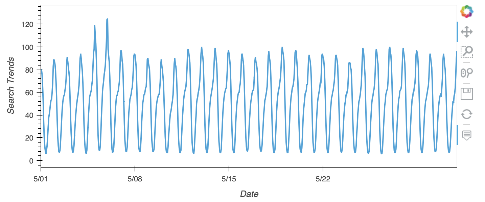
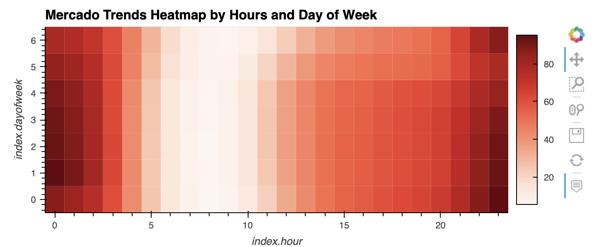
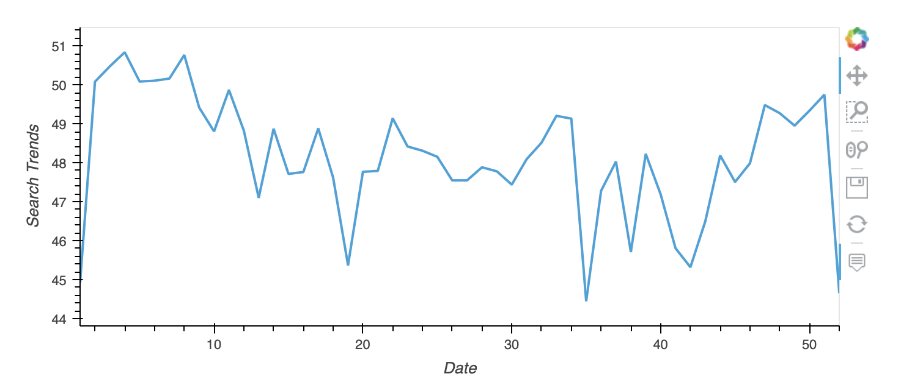
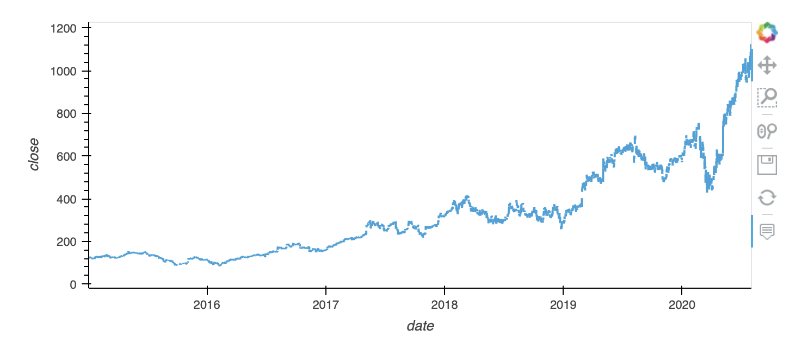
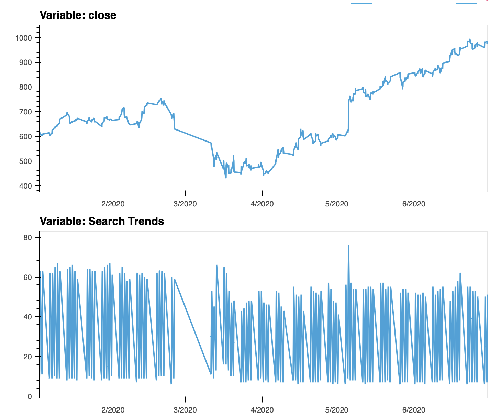
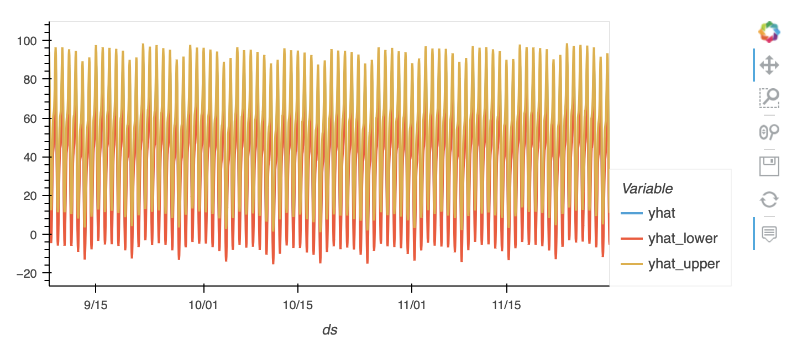
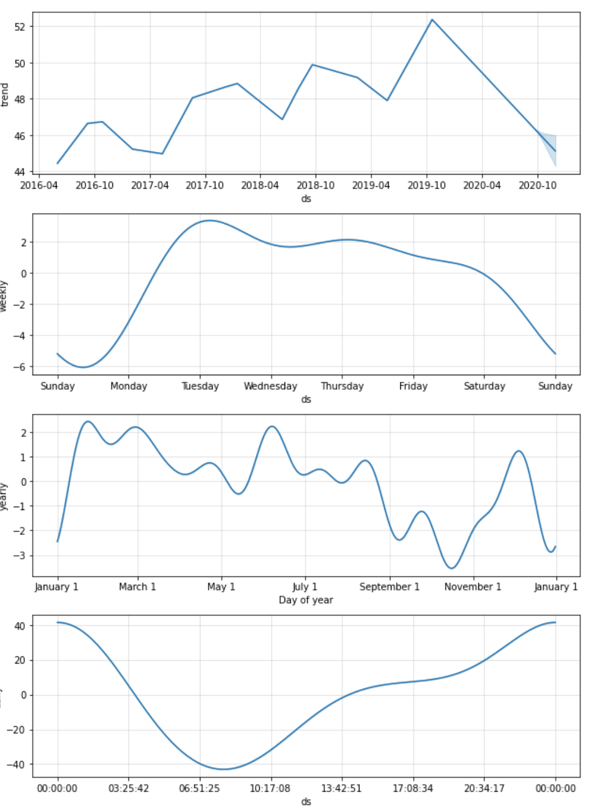

## Mercado Libre Trends and Forecasting

With over 200 million users, MercadoLibre is the most popular e-commerce site in Latin America. This notebook analyzes the company's financial and user data.  This notebook finds patterns in search data, looks for seasonality, compares search to stock price, and creates a time series model with Facebook Prophet.

---

## Technologies

This notebook requires:
- pystan
- fbprophet
- hvplot
- holoviews
- numpy

From those, the following libraries and dependencies are imported:

## Launch and Use

This application is a Jupyter Notebook.  Because of some difficulties with FB Prophet, it has been created in Google Colab.  If you ahve problems running the FB Prophet portion of the notebook, you might try to upload it to colab and run it there.  The needed CSV files will load from GitHub, so that should be seamless.
---

After importing the search data, we see a slice of the search data around the time of the earnings announcements.  As we can see from the graph, there is an increase in search activity around earnings.

---

Next, we look at the search traffic based on the days of the week.  Here, we see that the traffic is heaviest at the start of the week.

---

By looking into the time, we can see that the activity is highest early in the week and very early in the morning.

---

When we look at the weeks of the year, we see that there is a ramp up in search traffic that begins in the fall and peaks early in the year.

---

Moving on to review stock prices, we can see the overall stock price trend is very positive.

---

Looking more closely, we can see that the impact of COVID was short lived.

---

After running FB Prophet, we can see that the most likely ranges are relatively consistent over time.

---

Finally, looking at the FB Component graph we can see time-series trends.

## Contributors

This project was created as a part of the Rice FinTech Bootcamp.

---

## License

This software is licensed for use under the included MIT License.
